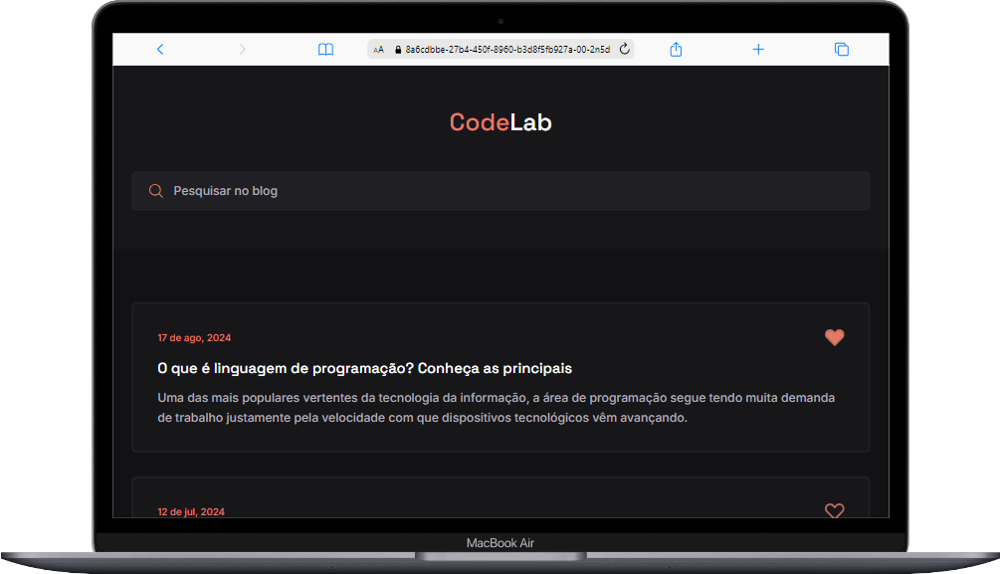

# Blog

## 📖 Sobre esse projeto

Este projeto é um componente interativo de cards para um blog, onde os usuários podem visualizar, buscar e interagir com os posts. Cada card representa uma postagem com título, data e descrição. O projeto é estilizado de forma moderna e responsiva, garantindo uma boa experiência de usuário tanto em dispositivos móveis quanto em desktops. 

<strong>Observação:</strong> Esse blog, faz parte do [Desafios frontend](https://github.com/iuricode/desafios-frontend)! Um projeto open-source com um conjunto de desafios pela comunidade <strong>CodeLab</strong>. Seu propósito é ajudar as pessoas a praticarem seus conhecimentos em desenvolvimento programação.

## ⚙️ Funcionalidades

- <strong>Exibição Dinâmica de Cards:</strong> Os cards são gerados dinamicamente a partir de um array de objetos JavaScript, preenchendo os dados de cada postagem, como data, título e descrição.
- <strong>Ordenação Cronológica:</strong> Os cards são ordenados automaticamente por data em ordem crescente, garantindo que as postagens mais antigas apareçam primeiro.
- <strong>Busca de Postagens:</strong> O campo de busca permite que os usuários filtrem os cards exibidos em tempo real com base no título e na descrição das postagens.
- <strong>Interação com Ícones de Favorito:</strong> Os usuários podem clicar no ícone de coração em cada card para marcar a postagem como favorita. O estado dos ícones de coração é salvo no <strong>`localStorage`</strong>, garantindo que as seleções permaneçam mesmo após o recarregamento da página.
- <strong>Animações de Scroll:</strong> A biblioteca ScrollReveal é usada para adicionar animações de revelação suave à medida que os cards entram em vista ao rolar a página.

## 🛠️ Tecnologias Utilizadas 

- <strong>HTML:</strong> Para a estruturação do conteúdo dos cards.
- <strong>CSS:</strong> Para estilização moderna e responsiva dos cards e outros elementos da interface.
- <strong>JavaScript:</strong> Para a manipulação dinâmica do DOM, ordenação de dados, filtragem de postagens, e gerenciamento de estados.
- <strong>LocalStorage:</strong> Para salvar o estado dos ícones de coração clicados e garantir persistência dos dados entre sessões.
- <strong>ScrollReveal.js:</strong> Para adicionar animações de revelação ao rolar a página, melhorando a experiência visual do usuário.

## 🔗 Links

- [Desafios Frontend](https://github.com/iuricode/desafios-frontend)
- [Drive dos Desafios](https://bit.ly/drive-codelab)
- [Figma do Projeto](https://bit.ly/codelab-desafio-1)

## 📸 Screenshots

## 🚀 Deploy

Para fazer o deploy desse projeto utilizei o <strong>GitHub Pages</strong>, [clique aqui](https://wwwmisla.github.io/desafios-frontend/desafio-01/), para visualizar.

## 👥 Autores

- [@wwwmisla](https://www.github.com/wwwmisla)

## 📝 Licença

Este projeto está sob a licença [MIT](LICENSE).